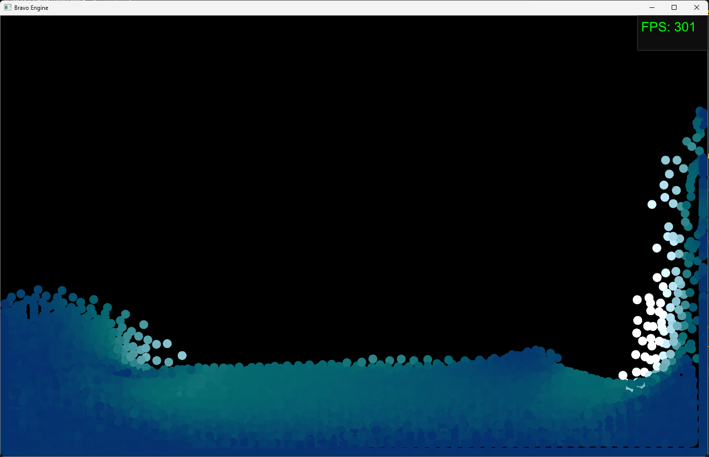
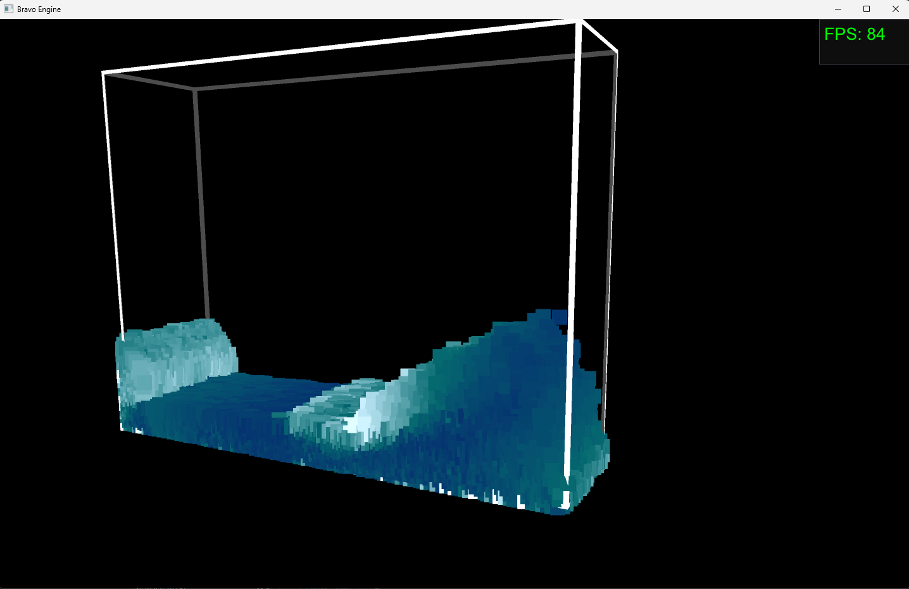

# My Custom OpenGL Game Engine

This project is a custom game engine, inspired by Unreal Engine, designed for learning OpenGL and exploring various game engine features.

(Note: This project is an experimental game engine built for learning and exploration. While it is not production-ready and lacks some core features, it serves as a platform to experiment with game engine concepts and techniques.)

## Features
 - Lighting: Supports directional, point, and spot lights.
 - Shadows: Cascade shadows for directional lights, creating realistic lighting effects.
 - Post-Processing: Easy integration for custom post-process effects.
 - UI System: Basic UI elements using the ImGui library.
 - Model Loading: Integrated Assimp for loading various 3D model formats.
 - Reflection System: RTTR is included to enable reflection, planned for use in editor tools and serialization.
 - Advanced Delegates: Implements advanced Unreal-like C++ delegates for flexible event handling.

## Projects I've developed using my engine

  - PBR material demo with basics lighting and shadows
  

  - Particle-based Fluid Simulation using compute shaders:
        [3D simulation](https://youtu.be/AKP-av83-H4?si=JyxycT73ULsHNfo3),
        [2D simulation with user interaction](https://youtu.be/Hkz3_GT-KfU)
    
    

    
  - Basic path tracer
    

## Future Plans (with no specific order)
 - Path Tracing rendering (Work in progress)
 - Scene Editor and serialization (Work in progress)
 - Improve fluid rendering using ray-marching technique
 - OIT
 - Physics integration
 - occulusion culling
 - frustum culling
 - bloom
 - anti-aliasing
 - animations
 - landscape rendeing (Work in progress)
 
## Dependencies and 3rd parties used
OpenGL 4.3 or higher

GLFW for window and context management

GLM for OpenGL Mathematics

[ImGui for UI components](https://github.com/ocornut/imgui)

[Assimp for 3D model loading](https://github.com/assimp/assimp)

[RTTR for runtime type reflection](https://www.rttr.org/)

[Glad for managing OpenGL function pointers](https://glad.dav1d.de/)

[STB for image loading](https://github.com/nothings/stb)

[Radix sort implemeted for Vulkan](https://github.com/MircoWerner/VkRadixSort)

[Advanced Unreal-like delegates for c++](https://benui.ca/unreal/delegates-advanced)
